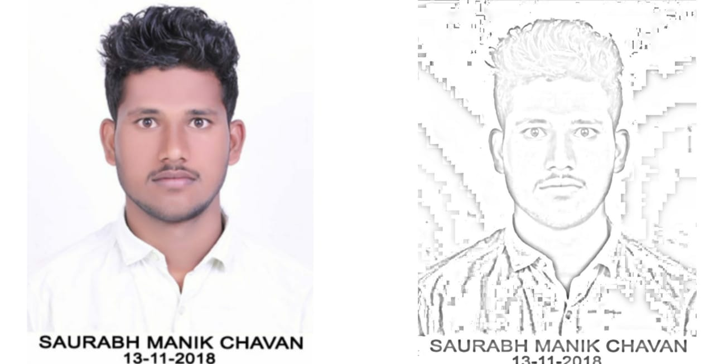

# image-to-sketch-python

in this tutorial we will create a intresting project which is how to convert a image into a sketch

let's get start...... :) 

modules required for the project.. 

1.numpy to install this modules you have to use the command:)=pip install numpy 

2.imageio installation:)= pip install imageio

3.opencv installation:)=pip install opencv-python

let's go the editor i.e.VSCode

    #import the libraries
    import numpy as np
    import imageio
    import scipy.ndimage
    import cv2
  
    #lets create a variable which will store a image
    img="my.jpg"
  
    def grayscale(rgb):
         return np.dot(rgb[...,:3],[0.299,0.587,0.114]) #this is the formuleto convert an image to black and white image
  
    #this function will convert your image into sketch formate
     def dodge(front,back):
        result=front*255/(255-back)
        result[result>255]=255
        result[result==255]=255
        return result.astype('uint8')
       
    s=imageio.imread("my.jpg")
    g=grayscale(s)
    i=255-g
  
    #lets create blurred image
    b=scipy.ndimage.filters.gaussian_filter(i,sigma=10)
    r=dodge(b,g)
  
    #write the name of the picture which you have to want
    cv2.imwrite("my_sketch.png",r)
